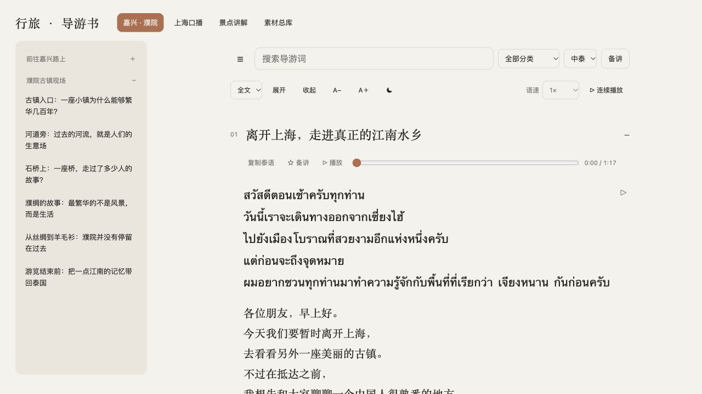

# 行旅 · Travel Guide

**A Chinese–Thai tour-guiding reader built from practical tourism content, with Thai narration and a quiet reading interface.**

[Live demo](https://jiaxing-puyuan-thai-guide.pages.dev/) · [中文说明](README.zh-CN.md) · [Portfolio / résumé wording](PORTFOLIO.md)



## Why I built it

Tour guiding combines language, storytelling and practical judgment. A guide needs to find the right passage quickly, rehearse its Thai pronunciation, and check the Chinese meaning without losing the original text.

I brought my Chinese–Thai tourism content into one working reader and used AI-assisted development to turn it into a deployed product. The project connects multilingual communication, domain-specific content and practical product iteration.

## What is available

| Collection | Chapters | Purpose |
| --- | ---: | --- |
| Jiaxing & Puyuan | 11 | Jiangnan culture and the ancient town of Puyuan |
| Shanghai spoken scripts | 129 | Airport transfers, a three-day itinerary, attractions and everyday life |
| Attraction explanations | 31 | Reusable destination briefings |
| Script library | 180 | Reference passages and alternative material |
| **Total** | **351** | **Collection entries; some topics overlap** |

- Chinese, Thai or bilingual reading, search, favorites and short/full versions.
- Collapsible navigation, adjustable type size and light/dark themes.
- Thai male narration for the **11 Jiaxing & Puyuan chapters**, using 13 prerecorded audio files. Shanghai and the other collections currently contain text only.
- Paragraph playback, continuous playback, playback speed from 0.5× to 2×, and seeking.
- An optional paragraph “译” button that sends Thai text to a compatible **GPT 随页助手** Chrome extension. Translation remains in the extension side panel; source passages stay intact.

The compatible extension is separately installed and is not bundled with this repository. The ordinary reader and available audio work without it. Translation uses the extension's ChatGPT connection; this repository does not contain API credentials or an AI backend.

## My contribution

I defined the reading and rehearsal workflow, brought together the guide material, directed the bilingual presentation and narration requirements, and refined the product through repeated use. Implementation was developed with AI assistance. My focus was deciding what the product should do, checking the result, and improving details that affected actual reading and learning.

Examples of those iterations include keeping Thai playback controls visible in Chinese mode, separating side-panel translation from the source, adding paragraph dividers, and simplifying the interface to remove redundant notes.

This is a personal working portfolio project. It does not claim paying customers, production-scale usage, independent translation certification, or training a speech model.

## Technology

Vanilla JavaScript, HTML and CSS; JSON content collections; the browser's audio element; localStorage for preferences and favorites; Cloudflare Pages for the live deployment. There is no application server or database requirement for the reader.

The Thai audio was generated using ElevenLabs. The repository streams these recordings from the live Cloudflare site; the MP3 files are not included in GitHub. An internet connection is required for narration. Playback uses existing recordings, so reading or changing speed does not generate new audio or consume TTS API credits.

## Run locally

Requires Python 3 for a simple static server:

```sh
python3 -m http.server 8000
```

Open <http://localhost:8000>. Serve the folder over HTTP rather than opening `index.html` directly, because the app fetches its JSON files.

## Keyboard controls

| Key | Action |
| --- | --- |
| `+` / `-` | Increase / decrease text size |
| `↑` / `↓` | Increase / decrease narration speed |
| Space twice quickly | Toggle light/dark theme |
| `←` / `→` | Seek backward / forward 3 seconds |
| `R` | Replay the current spoken line |

Keyboard shortcuts do not fire while typing in inputs. Spoken-line replay uses timestamp alignment; boundaries may be approximate.

## Repository structure

```text
index.html            Reading layout and styles
app.js                Navigation, settings, audio and paragraph actions
content.json          Collection manifest
book-*.json           Chinese–Thai content
audio-map.json       Recording and text timing data
docs/                Product screenshots
PORTFOLIO.md         Case study and résumé wording
```

## Checks

```sh
node --check app.js
node tests/keyboard.cjs
python3 tests/content.py
```

GitHub Actions runs these checks on pushes and pull requests. They test keyboard behavior and validate the content and hosted audio references.

## Verification and current limits

The live site was checked for collection navigation, Chinese-mode playback controls, font and speed shortcuts, double-Space theme switching, paragraph dividers and side-panel translation. The audio keyboard checks include seeking across split recordings and guarding text inputs. These are functional checks, not accessibility certification or a claim of perfect speech alignment.

Tourism statements and translations should be reviewed before professional use. The collections include overlapping material. Favorites and preferences are stored in the current browser, not synchronized between devices.

No open-source license is granted at this time. The published source, guide text and generated audio are provided for portfolio review; third-party tools retain their own rights and terms.
